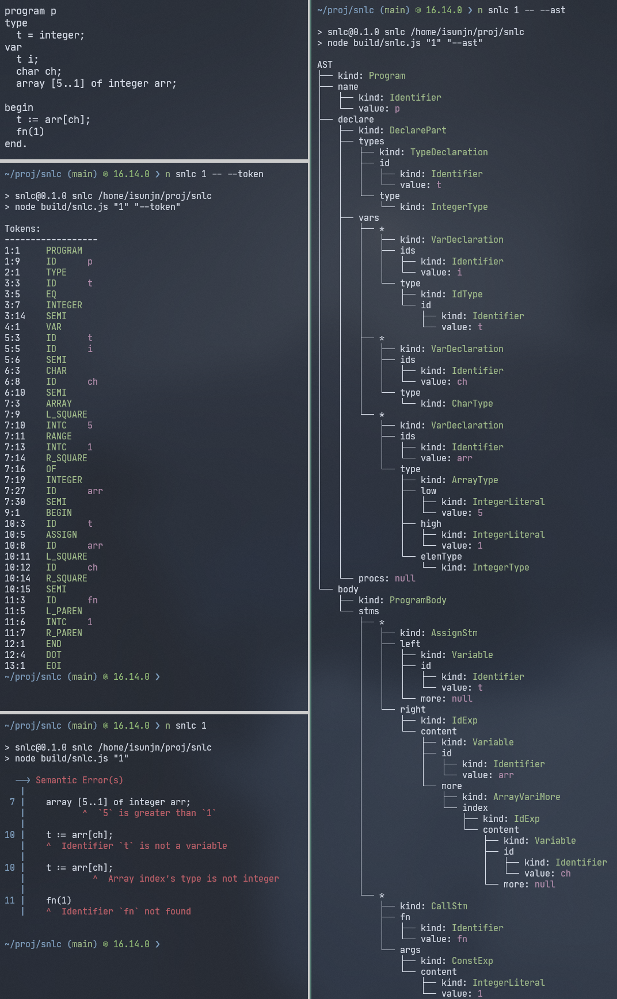

# Typescript implementation of SNL compiler front-end

SNL (Small Nested Language) is a pascal-like procedural language used for teaching purpose.

It's a suitable language for a toy compiler as it is very simple (and therefore incapable).

Check `docs/snl.bnf` and sample snl code in `sample` folder to find out more about this language.

## Features

- Lexical analysis
- Syntax analysis
    - Predict set and table generated on the fly
    - Recursive descent parsing
    - LL(1) parsing
- Semantic analysis
- Command line interface

## Usage

0. You should have `node` and `npm` (or `pnpm`, `yarn`) in your computer and know the basic usage. (This project is using pnpm, you can also choose npm or yarn, doesn't matter too much)
1. Clone this repo and enter the directory
2. Run `pnpm install` (or `npm install`)
3. Run `pnpm build` (or `npm run build`) to build the project
4. `pnpm snlc <file> -- <flags>` (or `npm run snlc <file> -- <flags>`)
    - `--set` show predict sets
    - `--table` show predict table
    - `--token` show token list
    - `--ast` show AST
    - `--ll` use LL(1) parser as parser, the default is recursive descent parser
    - If the file is in `sample` folder, then you can omit full path and just type file name for convenience
    - For example, `pnpm snlc 1 -- --ast` will compile `sample/1.snl` and print AST

 

